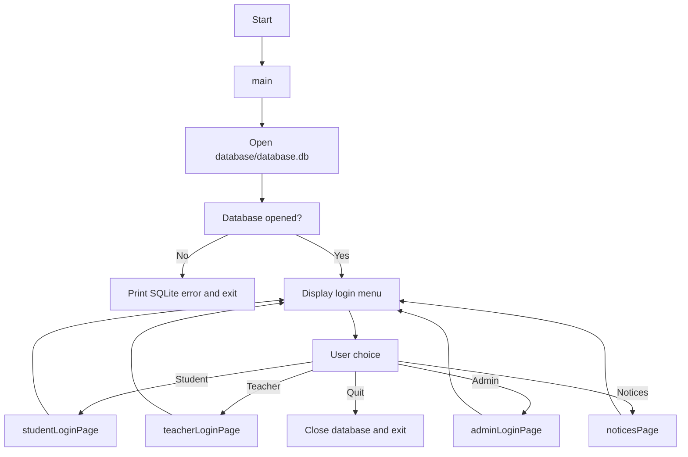
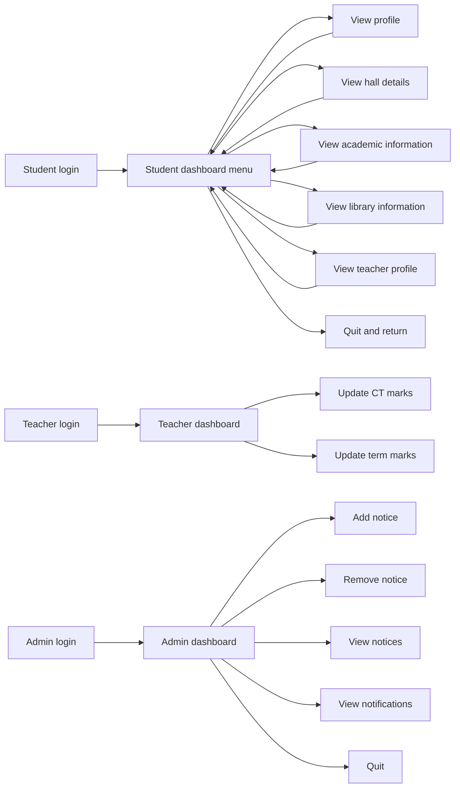
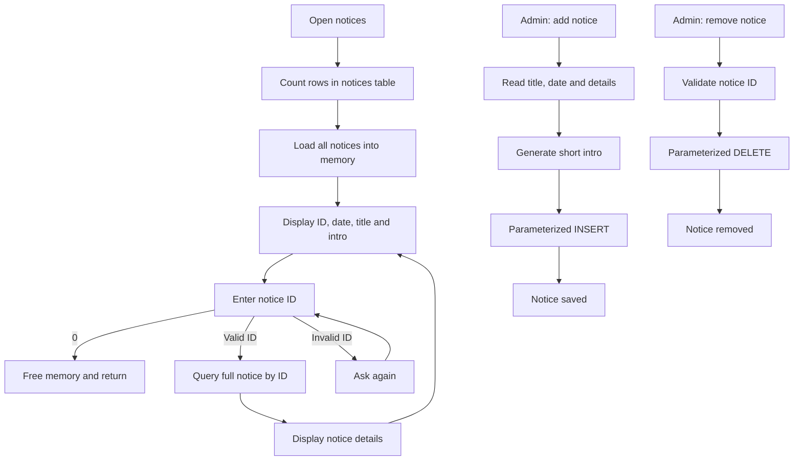
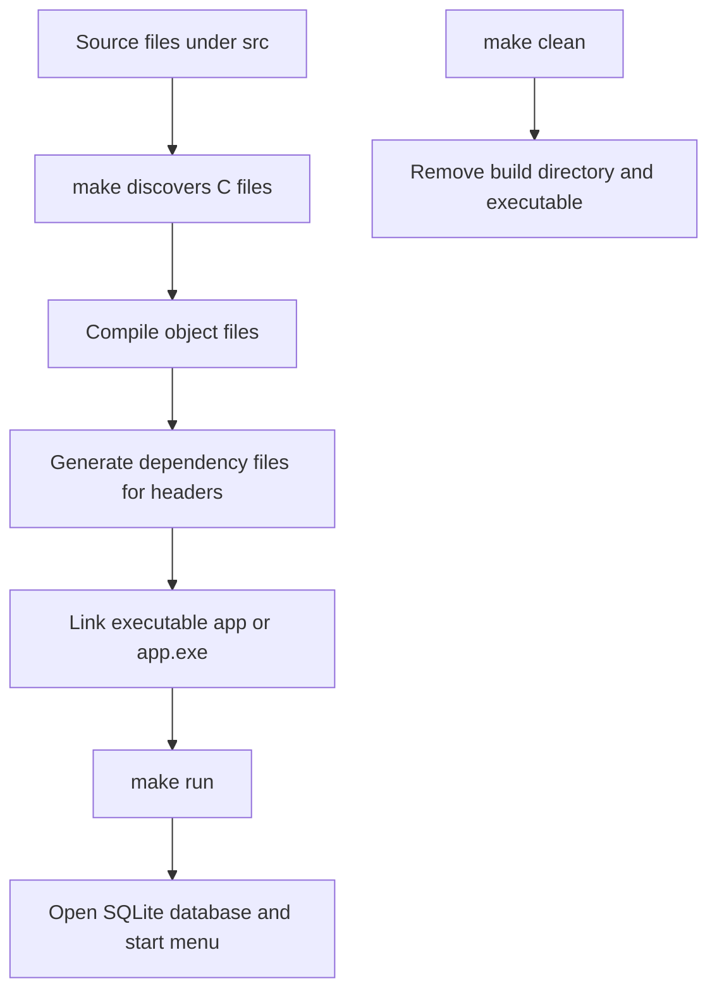

# Integrated KUET CMS — Workflow Summary

## 1. System overview

Integrated KUET CMS is a C11 console application backed by a local SQLite database.
The current implementation is organized by role and feature:

- **Authentication:** student, teacher, and admin entry points.
- **Student area:** profile, hall, library, academic, and teacher-profile views.
- **Teacher area:** dashboard shell for updating CT and term marks.
- **Admin area:** notice creation, deletion, viewing, and a notifications placeholder.
- **Shared services:** SQLite database opening, input helpers, screen clearing, and display formatting.

The application entry point is [`src/main.c`](src/main.c). It opens
`database/database.db`, then transfers control to the common login menu.

## 2. Main application flow

`loginPage()` validates menu input from 1 through 5. Student and teacher login
currently act as placeholders and immediately open their dashboards. Admin login
checks hard-coded credentials (`1001` / `2002`) before opening the admin dashboard.

## 3. Role workflows

The student dashboard now presents a selectable menu and returns to that menu
after each page. The academic-information and library-information pages wait for
ENTER before returning. The teacher options are displayed but are not wired to an
input loop. Several student pages display static or placeholder data and do not
query the database.

## 4. Notice workflow

The only defined database table is `notices`, with `notice_id`, `date`, `title`,
`intro`, and `details` fields. [`database/seed.sql`](database/seed.sql) supplies
initial notices. Notice reads and writes use prepared statements and bound
parameters.

## 5. Build and execution workflow

The [`makefile`](makefile) uses GCC, C11, warnings, debug symbols, automatic
header dependencies, and OS-aware cleanup commands.

## 6. Current implementation status

### Working or substantially implemented

- Common menu loop and input validation.
- SQLite database opening and shutdown.
- Notice listing, detail viewing, addition, and deletion.
- Admin password gate.
- Selectable student dashboard with return-to-menu behavior.
- Academic and library pages with ENTER-to-return prompts.
- Basic display/input utility functions.
- Seed data and a reusable local database file.

### Incomplete or needing attention

- Student and teacher authentication are placeholders.
- Student pages are mostly static demonstrations; no student data tables exist.
- Teacher mark editing is only a display stub.
- Admin notifications are only a placeholder.
- Error handling around several SQLite prepare/bind calls is incomplete.
- `clearScreen()` is Windows-specific (`cls`) despite the makefile supporting
  non-Windows builds.

## 7. Suggested next implementation order

1. Add user, student, teacher, course, marks, and hall/library tables.
2. Replace placeholder login pages with database-backed authentication.
3. Wire the remaining student pages to persistent data.
4. Convert the teacher dashboard into a selectable menu loop.
5. Add complete SQLite error checking and transaction handling.
6. Add targeted tests for authentication, notice CRUD, and invalid input.
